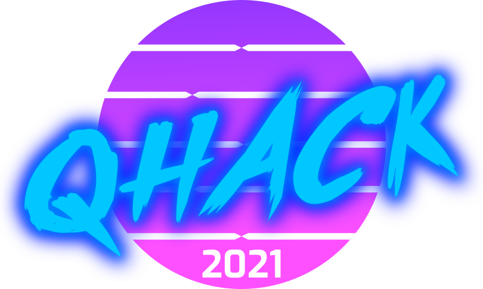

<p align="center" width="400">
  
</p>

# QHack 2021 Coding Challenge

The [QHack 2021 Coding Challenge](https://challenge.qhack.ai) presents a series of QML-based coding challenges for you to tackle. Please read the following carefully for details on the scoring system, how to register and submit your problems, and other aspects of the challenge.

### Template files are provided for you to simplify the submission process for the [QHack 2021 Coding Challenge](https://challenge.qhack.ai). Please base your solutions off of these template files as any other form of submission will likely fail the judging process. [Get the template files here](https://github.com/XanaduAI/QHack/tree/main/QML_Challenges/).

## Table of Contents
1. [Problem Categories](#categories)
1. [Submission Templates](#templates)
1. [What's in the Templates](#provided)
1. [Setting Up Your Environment](#setup)
1. [Testing Your Solutions](#testing)
1. [Submission Outcomes](#outcomes)
1. [Authors](#Authors)
1. [Acknowledgements](#Acknowledgements)
1. [Contact](#Contact)

## Problem Categories<a name="categories" />

The Challenge problems are divided into 4 categories: 

- Simple Circuits
- Quantum Gradients
- Circuit Training
- Variational Quantum Eigensolver (VQE)

Each category contains 3 problems worth differing amounts of points. The "Simple Circuits" problem set contains questions valued at 20, 30, and 50 points. This category is intended primarily as a tutorial so you can get used to the submission process, as well as learn the basics of [PennyLane](https://pennylane.ai), the software library in which all the problems are written. The other three categories have problems valued at 100, 200, and 500 points. 

**The challenges may be completed in any order**, but for true beginners we recommend starting with the *Simple Circuits* problems before progressing to the more challenging ones. While in some cases solving the lower-valued problems will provide insight into the higher-valued ones, all of the problems are intended to be self-contained and do not require any code or numerical values to be carried forward through a category.

## Submission Templates<a name="templates" />

Because of the strict submission requirements, it is strongly encouraged that you base your submissions off of the supplied [problem templates](https://github.com/XanaduAI/QHack/tree/main/QML_Challenges/). 

Avoid modifying these templates in any way beyond where it is indicated for you to do so, as this will most likely result in a failed submission. Even within the modifiable portion of the script, do not add any print statements or try to plot, as this will interfere with the assessment of the solution.   

Do not import any external libraries in these templates. The only libraries that will be available when your submission is run are those in the [requirements.txt file](https://github.com/XanaduAI/QHack/blob/main/QML_Challenges/requirements.txt) found in the [problem templates repository](https://github.com/XanaduAI/QHack/tree/main/QML_Challenges/). 

### Downloading The Templates

If you use git:

```console
git clone https://github.com/XanaduAI/QHack.git
```  
or 
```console 
git clone git@github.com:XanaduAI/QHack.git
```  

If you don't use `git`, you can download a zipped version of this repository [here](https://github.com/XanaduAI/QHack/archive/main.zip).

### What's Provided For You<a name="provided" />

Every problem in the Coding Challenge has a corresponding directory nested under `QML_Challenges/` of the form `<problem_name>_<points>_template/`. Within each problem template folder are three types of files to help you with the coding challenges:  

1. **problem.pdf**  
    This is the statement of the problem you're being challenged to solve, along with any constraints that may be imposed. Read these over carefully before tackling the corresponding Coding Challenge problem. If you're having problems viewing these you can also find a description of the problems at [the Challenge Problems page](https://challenge.qhack.ai/public/problems).

2. **\<problem_name\>_\<points\>_template.py**  
    These are the Python coding templates required for submitting your solution to a particular problem. Read the docstrings within these files carefully to see what code is required from you and where exactly you should add your solution (typically between `# QHACK #` comment markers).   
    **NOTE:** It is extremely important that you do not import any additional libraries or modify any of the code in these files other than where specified, as this may result in your submission failing the automated judging process. See the sections below on testing your solutions locally and submitting them for judging.   
3. **\#.in and \#.ans files**  
    The numbered `.in` and `.ans` files are the input and corresponding expected output, respectively, for your solution. They are the data files for the problem. Do not modify these files! Once you have added your code to the `<>_template.py` file, passing the `#.in` file to the modified `<>_template.py` file via `stdin` should result in output that matches the corresponding `#.ans` file. Your generated answer may not match the value(s) in the corresponding `#.ans` file exactly, but that's normal. As long as they match to within a tolerance specified in the `problem.pdf` file, then your solution will be judged to be correct. More details on how to test your solutions locally are provided in a section below.

## Setting Up Your Environment<a name="setup" />

All solutions must be written in Python and be compatible with Python 3.7. Instructions for installing Python 3.7 are out of scope for this document, but many web resources exist for how to install Python 3.7 on your chosen OS.

We have included a [requirements.txt](https://github.com/XanaduAI/QHack/blob/main/QML_Challenges/requirements.txt) file that specifies the libraries which you will need to be able to run and test your solutions locally. Installing these can be done on the command line via `pip`:  

```console
pip install -r requirements.txt
```  

We recommend that you set up a virtual environment to keep these packages isolated from the rest of your installed Python libraries. Setting up a virtual environment is also out of scope for this document, but many tutorials for doing so with your Python distribution and OS are available online. 

## Testing Your Solutions<a name="testing" />

Once you have added your code to one of the solution templates, you can test if it is correct by supplying one of the `#.in` files for that problem to the solution script via stdin. 

For example, if you've added a solution for the 100 point Circuit Training problem and you want to test the solution using the first set of inputs, do the following:
 * Open a terminal console (`CMD`, `Terminal`, etc.) and navigate to the folder containing your solution
 * Run your modified Python template and pass in the inputs:  
`python ./circuit_training_100_template.py < 1.in`
 * Check what was output to the console. If everything worked, you should see a single number or series of comma delimited numbers and nothing else
 * Open the file `1.ans` for this problem and compare its contents to what was written to the command line. They should match to within some tolerance specified in the `problem.pdf` to be judged correct.

# Submission Outcomes<a name="outcomes" />
There are several possible outcomes following a submission in competition:

### Correct
Congratulations! The points are yours.

### Wrong Answer
Some part of your solution is incorrect. Double check that when run locally your outputs match the expected outputs to within the allowed tolerance. 

### Run-Error
Something in your solution caused the assessment process to fail. Double check that you don't have any print statements, warnings, imports of additional packages, or other run-time errors.

### Too-Late
The contest has temporarily ended to award the prizes to the top Teams. Don't worry, once the contest is restarted this submission will be graded and appear on the scoreboard. 

## Authors<a name="Authors" />

| [<br /><sub> Joel</sub>](https://github.com/Joelqai) <br /> 💻 💬 📖 💡 🤔 | [<br /><sub> Leo</sub>](https://github.com/leo07010) <br /> 💻 👀 📖  🤔 | [<br /><sub>Neo Chen</sub>](https://github.com/NeoChenCCY) <br />💻 👀 📖 💡 🤔 |
| :---: | :---: | :---: |

## Acknowledgements<a name="Acknowledgements" />

參賽隊伍 : Taiwanesse High School Student

## Contact<a name="Contact" />

解題團隊 : 賦智行雲科技股份有限公司(AGAI CorporationLtd.)

E-Mail : 9566039@gmail.com

地址 : 亞洲台灣新北市林口區仁愛路二段490號B5棟18樓

電話 : +886 987 516 908
